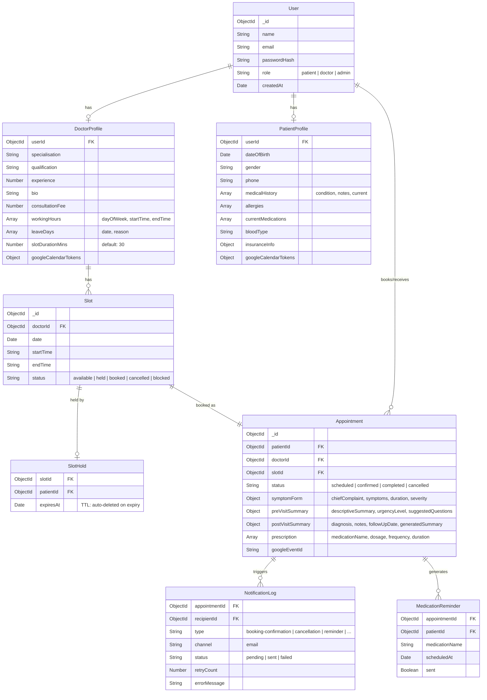
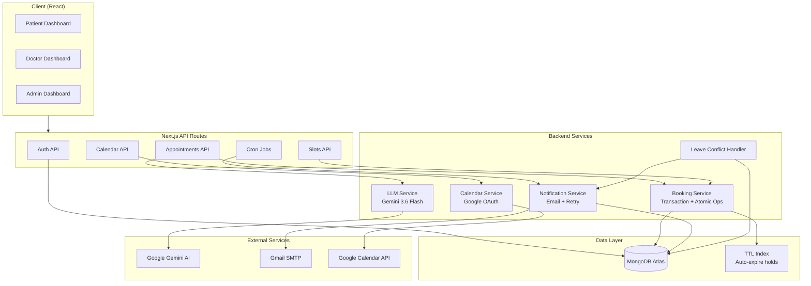
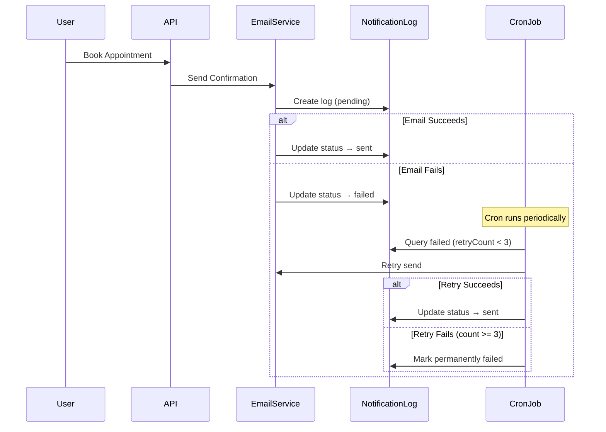

# Healthcare Appointment Platform

A full-stack healthcare appointment management system built with **Next.js 16**, **MongoDB**, and **Gemini AI**. The platform supports three user roles (Patient, Doctor, Admin) and provides end-to-end appointment lifecycle management with AI-powered clinical summaries, Google Calendar integration, and automated email notifications.

## Tech Stack

| Layer | Technology |
|-------|-----------|
| Framework | Next.js 16 (App Router, Turbopack) |
| Language | TypeScript / JavaScript |
| Database | MongoDB Atlas (Mongoose ODM) |
| Auth | NextAuth.js (Credentials) |
| AI/LLM | Google Gemini 3.6 Flash |
| Email | Nodemailer (SMTP) |
| Calendar | Google Calendar API (OAuth 2.0) |
| UI | Tailwind CSS, shadcn/ui, Lucide Icons |
| Validation | Zod, React Hook Form |

---

## Setup Guide

### Prerequisites

- Node.js ≥ 18
- MongoDB Atlas cluster (or local MongoDB)
- Google Cloud project with Calendar API enabled
- Gmail account with App Password (for SMTP)
- Gemini API key from [Google AI Studio](https://aistudio.google.com/)

### Installation

```bash
git clone https://github.com/princi-2306/healthcare-management.git
cd healthcare-management
npm install
```

### Environment Configuration

```bash
cp .env.example .env
```

Edit `.env` and fill in all values. See `.env.example` for the full list of required variables:

| Variable | Description |
|----------|-------------|
| `MONGODB_URI` | MongoDB connection string |
| `NEXTAUTH_URL` | App base URL (`http://localhost:3000` for dev) |
| `NEXTAUTH_SECRET` | Random string for JWT signing (min 32 chars) |
| `GEMINI_API_KEY` | Google Gemini API key for AI summaries |
| `SMTP_HOST` / `SMTP_PORT` / `SMTP_USER` / `SMTP_PASS` | SMTP credentials for email |
| `EMAIL_FROM` | Sender name and email for notifications |
| `GOOGLE_CLIENT_ID` / `GOOGLE_CLIENT_SECRET` | Google OAuth credentials for Calendar |
| `GOOGLE_REDIRECT_URI` | OAuth callback URL (`http://localhost:3000/api/calendar/callback`) |
| `CRON_SECRET` | Bearer token for securing cron endpoints |
| `ADMIN_EMAIL` / `ADMIN_PASSWORD` | Seeded admin credentials |

### Running

```bash
# Development
npm run dev

# Production build
npm run build
npm start
```

---

## Google Calendar Setup

1. Go to [Google Cloud Console](https://console.cloud.google.com/) → Create a new project
2. Enable the **Google Calendar API** under APIs & Services → Library
3. Configure the **OAuth consent screen** (External, add your test users)
4. Create **OAuth 2.0 credentials** (Web Application type):
   - Authorized redirect URI: `http://localhost:3000/api/calendar/callback`
5. Copy the **Client ID** and **Client Secret** into your `.env`
6. In the app, doctors/patients can connect their calendar from their profile page:
   - `GET /api/calendar/connect` → redirects to Google OAuth consent
   - `GET /api/calendar/callback` → exchanges code for tokens, stores in profile
7. Once connected, appointments are **auto-synced** to Google Calendar on booking (with `.ics` attachments in confirmation emails)

---

## Database Schema



---

## API Reference

### Authentication

| Method | Endpoint | Role | Description |
|--------|----------|------|-------------|
| POST | `/api/auth/register` | Public | Register new user |
| POST | `/api/auth/[...nextauth]` | Public | Login (NextAuth) |

### Appointments

| Method | Endpoint | Role | Description |
|--------|----------|------|-------------|
| GET | `/api/appointments` | Auth | List appointments (filtered by role) |
| POST | `/api/appointments` | Patient | Book appointment (atomic transaction) |
| GET | `/api/appointments/[id]` | Auth | Get appointment details |
| PATCH | `/api/appointments/[id]` | Auth | Cancel or update appointment |
| POST | `/api/appointments/[id]/pre-visit-summary` | Doctor | Generate AI pre-visit summary |
| POST | `/api/appointments/[id]/post-visit` | Doctor | Submit notes + prescription, generate AI summary |

### Doctors

| Method | Endpoint | Role | Description |
|--------|----------|------|-------------|
| GET | `/api/doctors` | Auth | List doctors (with search/filter) |
| GET | `/api/doctors/[id]` | Auth | Get doctor profile |
| GET | `/api/doctors/[id]/slots` | Auth | Get available slots for a date |
| POST | `/api/doctors/[id]/leave` | Admin | Mark leave day (cancels affected bookings) |
| GET | `/api/doctors/me` | Doctor | Get own profile |

### Slots

| Method | Endpoint | Role | Description |
|--------|----------|------|-------------|
| POST | `/api/slots/[id]/hold` | Patient | Create 10-min temporary hold |

### Calendar

| Method | Endpoint | Role | Description |
|--------|----------|------|-------------|
| GET | `/api/calendar/connect` | Auth | Start Google OAuth flow |
| GET | `/api/calendar/callback` | Public | OAuth callback handler |
| GET | `/api/calendar/status` | Auth | Check connection status |
| POST | `/api/calendar/sync/[id]` | Auth | Manual calendar sync |

### Cron Jobs

| Method | Endpoint | Auth | Description |
|--------|----------|------|-------------|
| GET | `/api/cron/appointment-reminders` | `CRON_SECRET` | Send 24h appointment reminders |
| GET | `/api/cron/medication-reminders` | `CRON_SECRET` | Send medication reminders |
| GET | `/api/cron/notification-retry` | `CRON_SECRET` | Retry failed email notifications |

### Webhooks

| Method | Endpoint | Description |
|--------|----------|-------------|
| POST | `/api/webhooks/email-status` | Email delivery status webhook |

---

## LLM Prompts

### Pre-Visit Summary (Gemini 3.6 Flash)

**Trigger:** Auto-generated on booking; lazily generated when doctor opens appointment page.

**System Prompt Role:** Expert clinical AI assistant that transforms patient symptom descriptions into structured summaries.

**Safety Rules:**
- No diagnosis, no prescriptions, no invented information
- Urgency based only on patient-provided data
- Patient-friendly language

**Output Schema:**
```json
{
  "descriptiveSummary": "3-4 sentence clinical summary",
  "urgencyLevel": "Low | Medium | High",
  "suggestedQuestions": ["5 questions from patient's POV for their doctor"],
  "missingInformation": ["Clinically relevant info not provided"]
}
```

**Input Construction:** Chief complaint, symptoms, duration, severity, additional notes, patient gender, and medical history are combined into a structured `<SYMPTOMS>` block.

### Post-Visit Summary (Gemini 3.6 Flash)

**Trigger:** Generated when doctor submits post-visit notes.

**System Prompt Role:** Clinical AI assistant creating patient-friendly visit summaries.

**Guidelines:** Explains diagnosis, medication purpose and usage, warning signs, and follow-up plan in an empathetic, professional tone.

**Output Schema:**
```json
{
  "descriptiveSummary": "Comprehensive paragraph summarizing the consultation"
}
```

**Input Construction:** Diagnosis, clinical notes, prescribed medications (with dosage/frequency/duration/instructions), and follow-up date.

**Fallback:** Both prompts have graceful degradation — if the LLM is unavailable, static fallback content is used and the appointment flow continues uninterrupted.

---

## System Design

### Architecture Overview



### Double-Booking Prevention (Three-Layer Defense)

Simultaneous booking attempts are a critical concurrency problem. The system uses three independent layers, each sufficient alone but combined for defense-in-depth.

**Layer 1 — Atomic Status Transition.** The `bookSlot()` function uses MongoDB's `findOneAndUpdate` with a status filter: `{ status: { $in: ["available", "held"] } }`. This is an atomic compare-and-swap — only the first concurrent request finds the slot as "available" and transitions it to "booked." The second request gets `null` and fails immediately with "Slot is no longer available." No race window exists because MongoDB executes the read-modify-write as a single atomic operation.

**Layer 2 — MongoDB Transaction.** The entire booking flow — slot status update, hold cleanup, and appointment creation — is wrapped in `session.withTransaction()`. If any step fails (e.g., appointment creation throws a validation error), the entire operation rolls back. This prevents orphaned states like a slot marked "booked" with no corresponding appointment.

**Layer 3 — Unique Database Index.** The `Appointment` collection has a unique index on `slotId`, enforced at the database engine level. Even if the atomic update somehow passed twice due to an unforeseen edge case, the second `Appointment.create()` would fail with a duplicate key error (`E11000`). This is the ultimate safety net.

### Slot Hold Mechanism

To prevent users from losing a slot while filling in the symptom form, the system implements a two-phase booking pattern. When a patient selects a slot, a `POST /api/slots/[id]/hold` request creates a `SlotHold` document with a 10-minute TTL and sets the slot status to "held." The `SlotHold` collection has a unique index on `slotId`, so if two patients attempt to hold the same slot simultaneously, one receives a duplicate key error, caught and returned as "Slot was just held by another patient."

The hold auto-expires via MongoDB's TTL index on the `expiresAt` field. When the TTL triggers, MongoDB automatically deletes the `SlotHold` document. The booking function accepts slots in both "available" and "held" status, so the patient who holds the slot can complete their booking within the 10-minute window. If they abandon the flow, the TTL cleanup releases the slot for others.

### Doctor Leave Conflict Handling

When an admin marks a doctor's leave day via `POST /api/doctors/[id]/leave`, the `handleLeaveConflicts()` job executes a three-step cascade: (1) query all slots for that doctor on the leave date, (2) find all `scheduled` or `confirmed` appointments on those slots and cancel each one with the reason "Doctor unavailable — leave day," and (3) block all remaining available slots by setting their status to "blocked" so no new bookings can be created. For each cancelled appointment, the system sends a cancellation email to the affected patient using the `sendWithRetry` service, which includes an `.ics` calendar cancellation attachment.

### Notification Failure Handling

Email delivery is inherently unreliable — SMTP servers may be temporarily unavailable, rate-limited, or reject connections. The system handles this through a three-tier resilience pattern.

**Tier 1 — Logging.** Every email attempt, regardless of outcome, creates a `NotificationLog` document storing the full email body, recipient, type, and status. This provides an auditable trail and enables replay.

**Tier 2 — Immediate Failure Tracking.** If `sendEmail()` fails, the log is marked as `status: "failed"` with the error message. The calling code does not throw — booking/cancellation flows continue successfully even if the email fails. This ensures that a transient SMTP outage never blocks a critical user action.

**Tier 3 — Cron-Based Retry.** The `GET /api/cron/notification-retry` endpoint (secured by `CRON_SECRET` bearer token) calls `retryFailedNotifications()`, which queries all logs with `status: "failed"` and `retryCount < 3`, re-sends each, and either marks as "sent" or increments the retry counter. After 3 failed attempts, the notification is permanently marked as failed. The retry schedule follows an exponential backoff pattern (1 min, 5 min, 15 min).



---

## Project Structure

```
src/
├── app/                         # Next.js App Router pages & API routes
│   ├── api/
│   │   ├── appointments/        # CRUD, pre-visit summary, post-visit
│   │   ├── auth/                # NextAuth, registration
│   │   ├── calendar/            # Google Calendar OAuth & sync
│   │   ├── cron/                # Scheduled jobs (reminders, retry)
│   │   ├── doctors/             # Doctor profiles, slots, leave
│   │   ├── slots/               # Slot hold mechanism
│   │   └── webhooks/            # Email delivery status
│   ├── admin/                   # Admin dashboard pages
│   ├── doctor/                  # Doctor dashboard pages
│   └── patient/                 # Patient dashboard pages
├── components/
│   ├── doctor/                  # PreVisitSummaryCard, PostVisitForm, etc.
│   ├── patient/                 # SymptomForm, AppointmentCard, etc.
│   ├── shared/                  # AppointmentCalendar, UrgencyBadge
│   └── ui/                      # shadcn/ui primitives
├── lib/
│   ├── booking/                 # book-slot.js, hold-slot.js (transactions)
│   ├── calendar/                # Google Calendar client & sync
│   ├── email/                   # SMTP client, retry, templates
│   ├── jobs/                    # Leave conflict handler, medication scheduler
│   ├── llm/                     # Gemini client, prompts, fallbacks
│   ├── notifications/           # Booking/cancellation/reminder emails
│   └── validators/              # Zod schemas
├── models/                      # Mongoose schemas (8 collections)
└── types/                       # TypeScript interfaces
```

---

## License

Private project — not licensed for redistribution.
